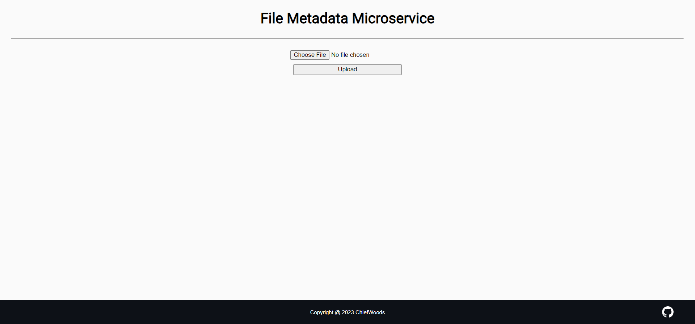

# File Metadata Microservice



File metadata microservice for Back End Development and APIs in [freeCodeCamp](https://www.freecodecamp.org/learn/).

[Live Website](https://file-metadata-microservice.chiefwoods.repl.co/)

[Source Repository](https://github.com/ChiefWoods/file-metadata-microservice)

## Built With

### Tools and Languages

- [](https://html5.org/)
- [](https://www.w3.org/Style/CSS/Overview.en.html)
- [](https://js.org/index.html)
- [](https://nodejs.org/en)

### Frameworks and Packages

- [Express](https://expressjs.com/)
- [CORS](https://github.com/expressjs/cors)
- [Multer](https://github.com/expressjs/multer)

## Getting Started

### Prerequisites

Update your npm package to the latest version.

```
npm install npm@latest -g
```

### Setup

1. Clone the repository.

```
git clone https://github.com/ChiefWoods/file-metadata-microservice.git
```
2. Install all dependencies
```
npm install
```
3. Run script
```
npm run start
```

## Issues

View the [open issues](https://github.com/ChiefWoods/file-metadata-microservice/issues) for a full list of proposed features and known bugs.

## Acknowledgements

### Resources

- [Shields.io](https://shields.io/)
- [Google Fonts](https://fonts.google.com/)
- [Pictogrammers](https://pictogrammers.com/)

### Hosting

- [Replit](https://replit.com/)

## Contact

[chii.yuen@hotmail.com](mailto:chii.yuen@hotmail.com)
